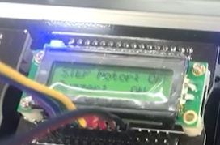

# Atmega128_Control

# 개요

Atmega128의 UART 시리얼 통신을 이용하여 Piezo Buzzer, Step Motor, PWM 제어를 이용한 LED 밝기변화 기능을 구현한 프로그램

# Piezo ON 구동

- 키보드 숫자키 1 입력시 piezo 멜로디 출력과 CLCD 상태변화

# Step Motor CW 방향 구동

- 키보드 숫자키 2 입력시 Step Motor가 CW 방향으로 회전과 CLCD 상태변화

# Step Motor CCW 방향 구동

- 키보드 숫자키 3 입력시 Step Motor가 CCW 방향으로 회전과 CLCD 상태변화

